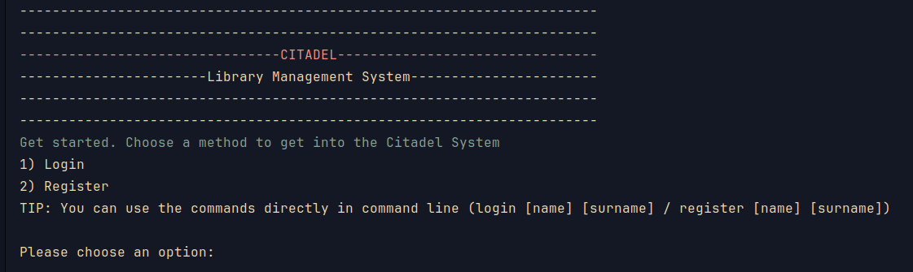
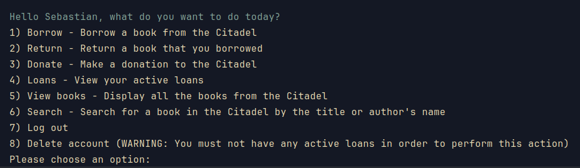
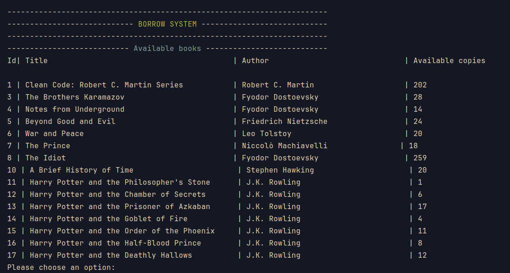
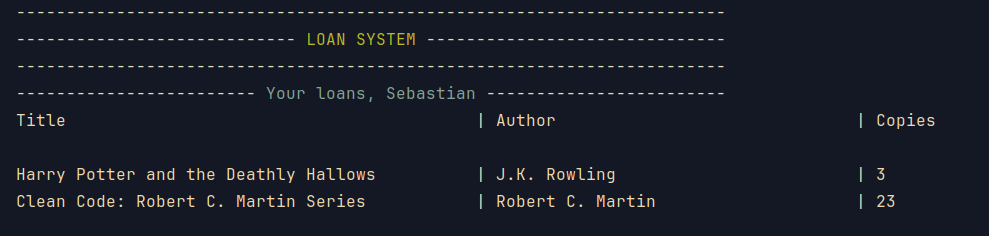

# Citadel - Library Management System
**Citadel** is a Library Management System made in C for the `Programming Project course`
## Features

### Header

### Menu

### Borrow System

### Loans

- [x] Authentification System
    - Login (first name, last name) from the menu
    - Register (create a new account) from the menu

- [x] Borrow System
    - Borrow a book from the menu as follows:
        - Books are printed on the screen
        - User selects a book
        - User selects the amount of copies
        - New loan created
        - User happy

- [x] Donation System
    - Donate a book to the library from the menu as follows:
        - Requests details about the book from the user
        - Checks the details
        - Add the book in the library
        - User happy
        - Library happy
      
- [x] Display all books from the library
- [x] Display all the loans of the user
- [ ] Search for a book
